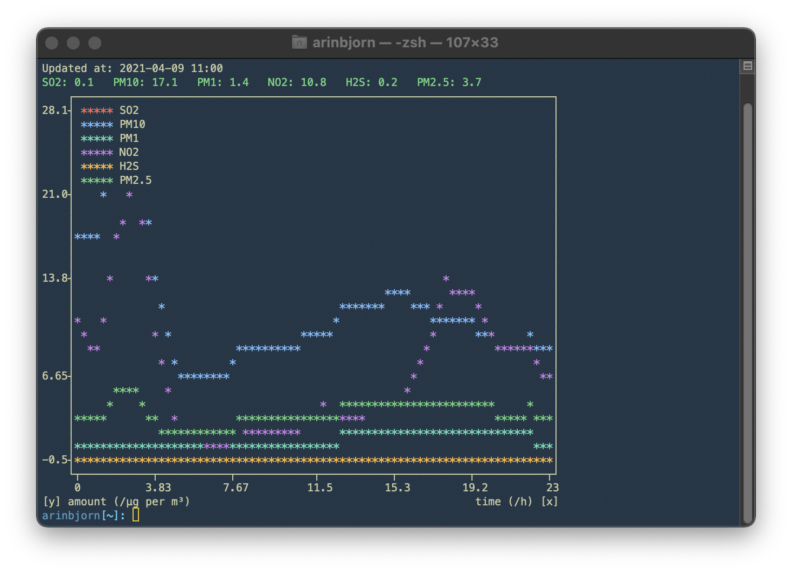

# volcano-air-quality

A simple command-line monitoring tool for air-quality in Reykjavík (Háaleitisbraut/Bústaðavegur).

It prints pollutants (updated every hour) and graphs them (past 24 hours) inside a terminal.

Currently, SO₂ and H₂S are of particular interest given emissions from the nearby volcanic eruption.

